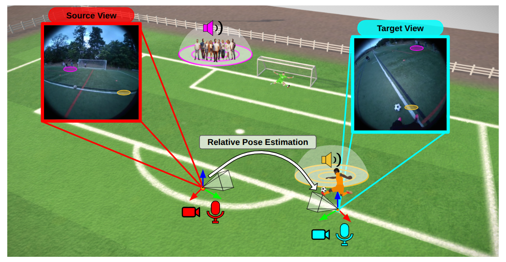
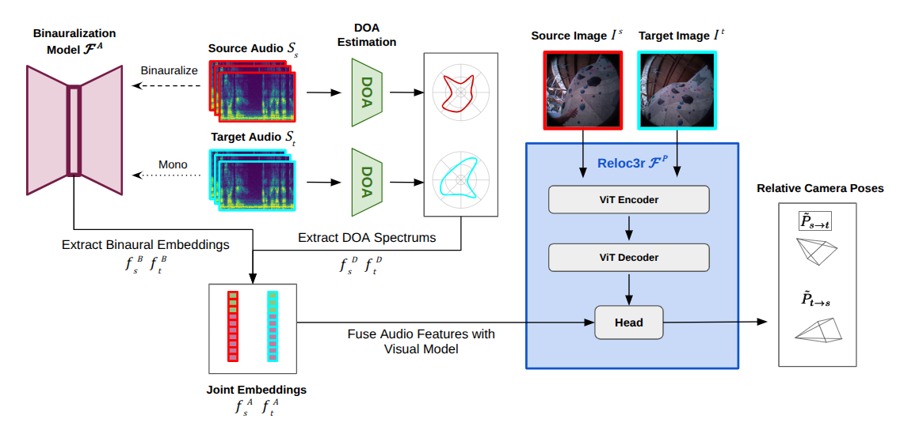

<h2>[ECCV 2026] Audio-Visual Camera Pose Estimation with Passive Scene Sounds and In-the-Wild Video</h2>
 
<p align="center">
<a href="https://danieladebi.com/">Daniel Adebi</a>   
 ·
<a href="https://sagnikmjr.github.io/">Sagnik Majumder</a>
 ·
<a href="https://www.cs.utexas.edu/~grauman/">Kristen Grauman</a>
</p>
<div align="center"> The University of Texas at Austin 

<h3>
<a href="https://vision.cs.utexas.edu/projects/av_camera_pose/"><strong>Project Page</strong></a>
&nbsp;|&nbsp;
<a href="https://arxiv.org/abs/2512.12165"><strong>arXiv</strong></a>
&nbsp;|&nbsp;
<a href="https://drive.google.com/drive/folders/122WEX7rsZCkld0oehP0fM4STukqShc9d?usp=drive_link"><strong>Data & Models</strong></a>
</h3>
</div>

<p align="center">

</p>

This repository contains the code and instructions to train our model for this project.

## Overview


We extend a vision-only relative-pose regressor (built on [Reloc3r](https://github.com/ffrivera0/reloc3r) / [DUSt3R](https://github.com/naver/dust3r)) with audio cues derived from the scene's ambient sound. Our released method fuses, for each image pair from the [Ego-Exo4D](https://ego-exo4d-data.org/) dataset:


- **Vision**: the two RGB frames,
- **DOA**: direction-of-arrival spectrums of the ambient audio, and
- **Binaural embeddings**: self-supervised binaural audio features

into a single relative-pose prediction. The diagram below displays our full method architecture.

<p align="center">

</p>


## Table of Contents

- [Overview](#overview)
- [Installation](#installation)
- [Data: Ego-Exo4D](#data-ego-exo4d)
- [Downloading pretrained audio caches & checkpoints](#downloading-pretrained-audio-caches--checkpoints)
- [Training](#training)
- [Evaluation](#evaluation)
- [Citation](#citation)
- [Acknowledgments](#acknowledgments)

## Installation

1. Clone the repository (with the CroCo submodule):
```bash
git clone --recursive <your-repo-url> audio-visual-camera-pose-estimator
cd audio-visual-camera-pose-estimator
# if you already cloned without --recursive:
# git submodule update --init --recursive
```

2. Create the environment:
```bash
conda create -n avpose python=3.11 cmake=3.14.0
conda activate avpose
conda install pytorch torchvision pytorch-cuda=12.1 -c pytorch -c nvidia  # match your CUDA
pip install -r requirements.txt
pip install -r requirements_optional.txt   # optional: HEIC image support
```

3. (Optional) Compile the CUDA kernels for RoPE positional embeddings for faster runtime:
```bash
cd croco/models/curope/
python setup.py build_ext --inplace
cd ../../../
```

4. Download the DUSt3R backbone weights used to initialize training and place them at
`checkpoints/DUSt3R_ViTLarge_BaseDecoder_512_dpt.pth`
(available from the [DUSt3R](https://github.com/naver/dust3r) project). This file is required for **training** only; evaluation loads the released checkpoint instead (`checkpoints/` is not committed to
the repo; see [Downloading pretrained audio caches & checkpoints](#downloading-pretrained-audio-caches--checkpoints)).

## Data: Ego-Exo4D

> [!IMPORTANT]
> The video and audio data are **not** included in this repository. You must download
> [**Ego-Exo4D**](https://ego-exo4d-data.org/) yourself, agree to its license, and follow the
> official instructions to obtain the takes (RGB frames + multichannel audio), or use the
> pre-curated copy below, which still requires you to have agreed to Ego-Exo4D's license.

For convenience, a curated copy of the processed data (RGB frames, camera poses, DOA, and audio)
is also available in the same Google Drive folder as the model/embedding downloads; see
[Downloading pretrained audio caches & checkpoints](#downloading-pretrained-audio-caches--checkpoints).

After downloading (curated or self-processed), point the dataset loader at your local copy. The
relevant paths live in `reloc3r/datasets/egoexo4d.py`:

- `DATA_ROOT`: root of the processed Ego-Exo4D camera-pose / audio data (frames, `camera_poses/`, `doa/`).
- `pairs_path`: the precomputed list of frame pairs per split.

The audio **embeddings/DOA caches** (the `embeddings_*` directories) are *not* committed to this
repository; they are large and regenerable. The dataset reads them, per take, from a directory
named by the `embedding_type` argument relative to the repository root, e.g. the released method
uses `embedding_type='embeddings_doa_1000ms_alt'`. You can either regenerate these caches yourself
(see below) or download pre-generated copies (see
[next section](#downloading-pretrained-audio-caches--checkpoints)).

## Downloading pretrained audio caches & checkpoints

Pre-generated audio caches and checkpoints are hosted here (Google Drive):
**https://drive.google.com/drive/folders/122WEX7rsZCkld0oehP0fM4STukqShc9d?usp=drive_link**

That folder has two subfolders:

**`dataset/`**

- **`camera_pose_audio_data.zip`**: a curated copy of the processed Ego-Exo4D data this repo
  reads from: `frames/`, `camera_poses/`, `doa/`, and `audio/` (raw 7-channel mic-array clips). This is provided purely for
  convenience; the underlying frames/audio are still Ego-Exo4D data, so you must have agreed to
  [Ego-Exo4D's license](https://ego-exo4d-data.org/) to use it. After unzipping, point `DATA_ROOT`
  in `reloc3r/datasets/egoexo4d.py` at wherever you extracted it (it does not need to sit inside
  the repo, unlike the items in `models_and_embeddings/` below).

  To keep the download a (relatively) reasonable size, `doa/` and `audio/` are filtered to **1000ms-duration files only** (the only duration this release's method uses; the source data has 60ms/500ms/1000ms
  variants of every frame). `audio/` clips are additionally stored as **FLAC** instead of raw WAV
  (lossless, bit-exact, measured ~3.7x smaller on this 7-channel/48kHz ambient audio).

  > [!NOTE]
  > These clips are `.flac`, not `.wav`, inside the zip. `egoexo4d.py` (and most other scripts in
  > this repo) open audio as `.wav` directly and won't read `.flac`: **decode them back to real
  > `.wav` files before using this data with anything else**:

  ```bash
  python datasets_preprocess/decode_camera_pose_audio_flac.py --root /path/to/camera_pose_audio_data
  ```

  (`--delete-flac` removes the source `.flac` after each successful decode, to save disk.)

**`models_and_embeddings/`**

- **`egoexo4d-av_cpe.pth`**: the released model checkpoint itself (vision + SLfM embeddings +
  DOA, the method described in the paper). Place it at
  `checkpoints/_egoexo4d-vision_slfm_embed_and_doa_360_1000ms-512_/checkpoint-last.pth`: that
  exact path is what `setup_reloc3r_relpose_model()` in `reloc3r/reloc3r_relpose.py` loads for
  this configuration (see [Evaluation](#evaluation)).

- **`embeddings_doa_1000ms_alt.zip`**: the DOA spectra. Nothing else. One 360-dim
  direction-of-arrival azimuth spectrum (pyroomacoustics NormMUSIC) per frame, saved as
  `doa_{take_name}_{frame_id:06d}.pt`. Unzip it at the repo root; it extracts directly to
  `embeddings_doa_1000ms_alt/{take_name}/doa_*.pt`, exactly where `egoexo4d.py` reads it from.

- **`binaural_model.zip`**: the mono→binaural (SLfM-style) audio encoder *model weights*, not
  embeddings. Unzip it at the repo root; it extracts to
  `checkpoints/slfm_m2b_egoexo4d/{checkpoint-best.pth,checkpoint-last.pth}`.

  **To turn these weights into the actual embeddings the checkpoint needs at eval time**, run:

  ```bash
  python datasets_preprocess/generate_embeddings_slfm_egoexo4d.py \
      --checkpoint checkpoints/slfm_m2b_egoexo4d/checkpoint-best.pth \
      --takes "$(ls /vision/vision_data_2/egoexo4d_audio/camera_pose_audio_data/audio | paste -sd, -)"
  ```

  The path in that command is specific to the internal machine this was generated on; swap it
  for your own Ego-Exo4D audio root.

  This writes one 1024-dim embedding per frame to
  `embeddings_slfm_egoexo4d/{take_name}/embedding1_{label}.pt` /
  `embedding2_{label}.pt`: the other half of the audio input the model expects (concatenated
  with the 360-dim DOA vector above into a 1384-dim vector). `--takes` is required
  (comma-separated, no "all" shortcut; the snippet lists every take under the Ego-Exo4D audio
  root); add `--device cpu` if no GPU is available.


**How the caches were generated (for reproducing or extending them yourself):**

1. `datasets_preprocess/generate_embeddings_doa_1000ms_alt.py`: reads the already-computed
   per-frame NormMUSIC DOA arrays cached under Ego-Exo4D's processed data root
   (`DATA_ROOT/doa/{take_name}/doa_{frame_id:06d}_duration_1000ms.npy`) and repackages the subset
   referenced by the train/val frame-pairs pickles into `embeddings_doa_1000ms_alt/`.
2. `datasets_preprocess/train_slfm_m2b_egoexo4d.py`: trains the mono→binaural audio encoder:
   mono conditioning audio is the mean of the 7-channel Ego-Exo4D mic array, the binaural target
   is the array's last two channels, and the model learns to reconstruct the binaural spectrogram
   from mono via a complex-mask U-Net (SLfM's `CondAudioEncoder` + `AudioCondUNet` architecture).
3. `datasets_preprocess/generate_embeddings_slfm_egoexo4d.py`: runs the trained encoder over each
   frame's own audio clip and saves the pooled 1024-dim bottleneck feature as both
   `embedding1_{label}.pt` and `embedding2_{label}.pt` under `embeddings_slfm_egoexo4d/{take_name}/`
   (the loader uses the `embedding1_`/`embedding2_` prefix to pick a source- vs. target-role file
   for the same frame, not two different embeddings).

## Training

The released method (vision + SLfM embeddings + DOA, on Ego-Exo4D) is trained with:

```bash
bash scripts/train_egoexo4d_1000ms_slfm_and_doa_360.sh
```

This launches `torchrun` across 8 GPUs and is equivalent to:

```bash
torchrun --nproc_per_node=8 train.py \
    --train_dataset "EgoExo4D(split='train', use_slfm_and_doa=True, resolution=(256, 256), embedding_type='embeddings_doa_1000ms_alt', sound_size=1000, use_img=True, transform=ColorJitter)" \
    --test_dataset  "EgoExo4D(split='val',   use_slfm_and_doa=True, resolution=(256, 256), embedding_type='embeddings_doa_1000ms_alt', sound_size=1000, use_img=True, seed=777)" \
    --model "Reloc3rRelpose(img_size=256, has_audio=True, has_audio_embedding=True, use_doa_and_embed=True)" \
    --pretrained "checkpoints/DUSt3R_ViTLarge_BaseDecoder_512_dpt.pth" \
    --lr 1e-5 --min_lr 1e-7 --warmup_epochs 5 --epochs 100 --batch_size 32 --accum_iter 1 \
    --save_freq 10 --keep_freq 10 --eval_freq 1 \
    --freeze_encoder \
    --output_dir "checkpoints/_egoexo4d-vision_slfm_embed_and_doa_360_1000ms-512_"
```

Checkpoints are written to `--output_dir` as `checkpoint-{epoch}.pth`, plus `checkpoint-best.pth`,
`checkpoint-last.pth`, and `checkpoint-final.pth`. The `scripts/` directory contains many additional
train/eval variants (audio-only, DOA-only, vision-only, SLfM-HM3D, policy models, etc.) used for ablations.

## Evaluation

A trained checkpoint for the released method goes under
`checkpoints/_egoexo4d-vision_slfm_embed_and_doa_360_1000ms-512_/checkpoint-last.pth` (download
`egoexo4d-av_cpe.pth` and place it there; see
[above](#downloading-pretrained-audio-caches--checkpoints)). Evaluate it on Ego-Exo4D with:

```bash
bash scripts/eval_egoexo4d_slfm_embed_and_doa_360_vision.sh
```

which runs:

```bash
python eval_relpose.py \
    --model "Reloc3rRelpose(img_size=256, has_audio=True, has_audio_embedding=True, use_doa_and_embed=True)" \
    --test_dataset "EgoExo4D(split='val', use_slfm_and_doa=True, resolution=(256, 256), embedding_type='embeddings_doa_1000ms_alt', sound_size=1000, use_img=True, seed=777)" \
    --batch_size 128
```

The exact checkpoint loaded for each model configuration is selected in
`setup_reloc3r_relpose_model()` in `reloc3r/reloc3r_relpose.py` (the active branch points at the
released SLfM+DOA+vision checkpoint). To write out per-pair pose errors / per-video AUCs, uncomment
the corresponding `np.save(...)` / `json.dump(...)` lines in `eval_relpose.py`.

To turn the saved per-video AUC files into aggregate tables/plots, use `process_aucs.py` /
`process_aucs_full.py` and the plotting scripts (`graph_line_plots.py`, `plot_ambient_audio_results.py`, etc.).


## Citation

This work was accepted to the **European Conference on Computer Vision (ECCV), 2026**. If you find it
useful in your research, please cite:

```bibtex
@inproceedings{adebi2026audiovisual,
  title     = {Audio-Visual Camera Pose Estimation with Passive Scene Sounds and In-the-Wild Video},
  author    = {Adebi, Daniel and Majumder, Sagnik and Grauman, Kristen},
  booktitle = {European Conference on Computer Vision (ECCV)},
  year      = {2026},
  url       = {https://arxiv.org/abs/2512.12165}
}
```

## Acknowledgments

Built on top of [Reloc3r](https://github.com/ffrivera0/reloc3r), [DUSt3R](https://github.com/naver/dust3r),
and [CroCo](https://github.com/naver/croco). Audio features build on self-supervised localization-from-motion (SLfM) and direction-of-arrival estimation. Data from [Ego-Exo4D](https://ego-exo4d-data.org/).


